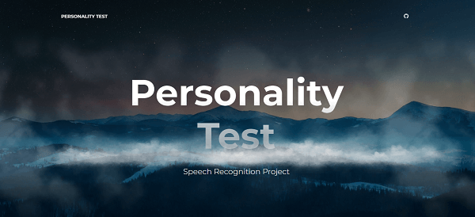

# sori :mega:
> Test your personality based on your speech!

This web app recognizes your speech :mega: and tells what personality you have. IBM Watson api makes it possible to do speech to text. And then your speech is sent to Indico api which provides amazing funtionalities. Indico api analyzes whether you sound emotional :cry: or confident :sunglasses:.
Just give it a try. It's a simple web app. Click the link below and open up the website.

To Start, first click "Speak" button. It might take a few seconds to wake up Heroku...:hourglass:
Once it starts listening, then introduce yourself. Then, click "Stop" to let the server stop listening.
If you want to start over, then click "clear all". Otherwise just scroll down. You will see two buttons. "Persona test" and "Emotion test". Both are provided by Indico api. Try both out. It will give you what personality you have and also tell you what emotion you have. Have fun!

By the way, I won a coding challenge with this web app :trophy: from [Zero to Mastery](https://github.com/zero-to-mastery/Coding_Challenge-3). It's one of the most popular Udemy online courses. 

* [Sori](https://april9288.github.io/sori/) - this website
* [Backend Repository](https://github.com/april9288/sori_api) - backend repo



## Getting Started

### Prerequisites

If you don't have Node.js setup on your computer, please click below link and download it first.

* [Node.js](https://nodejs.org/en/) - The official Node.js website to download

### Installing

If you already have Node.js, then follow below step.

On your terminal:

```
cd /c/<folder_path>
git https://github.com/april9288/rightnowkbbq.git
cd rightnowkbbq
npm install
npm start

```

So it will automatically run in your local server.

## Built With

* [React.js](https://reactjs.org/) - The official React.js website
* [Watson Speech Recognition API](https://www.ibm.com/watson/) - IBM Watson website
* [Indico Personality Analyzing API](https://indico.io/) - Indico website

## Meta

James Jongho Kim 
- [Portfolio](https://april9288.github.io/) - It's my portfolio website
- [Github](https://github.com/april9288) - This is my Github page
- april9288@gmail.com